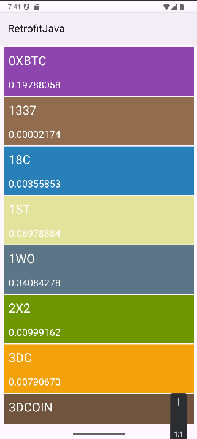

## 🚀 RetrofitJava Crypto App

Bu proje, Retrofit ve RxJava kullanarak kripto para verilerini çeken basit ama öğretici bir Android uygulamasıdır.
Canlı bir API yerine, GitHub üzerinde barındırılan JSON dosyasından veriler çekilmektedir.

**💡 Öğrenme amaçlı yapılmıştır — Retrofit, RxJava, RecyclerView ve Gson kullanımını pratik etmek için geliştirilmiştir.**

## ✨ Özellikler

📡 Retrofit + RxJava ile veri çekme

📊 RecyclerView üzerinde listeleme

🎨 Modern & Clean UI

📦 Gson Converter ile JSON parse işlemleri

🔄 RxJava CompositeDisposable yönetimi

## 🛠 Kullanılan Teknolojiler

- Java

- Retrofit

- RxJava

-Gson

-RecyclerView

## 📷 Ekran Görüntüsü

 

## 🎯 Amaç

Bu proje, Android geliştirirken Retrofit + RxJava mantığını kavramak için geliştirilmiştir.
İleride gerçek zamanlı API’lerden veri çekmek için temel bir başlangıç noktasıdır.
